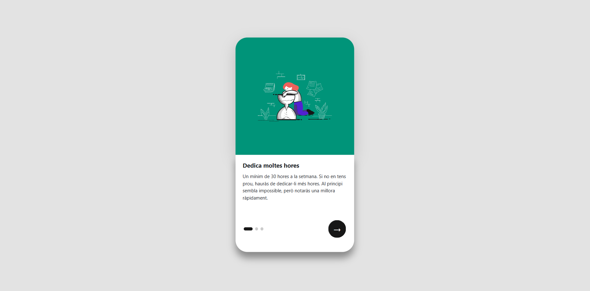
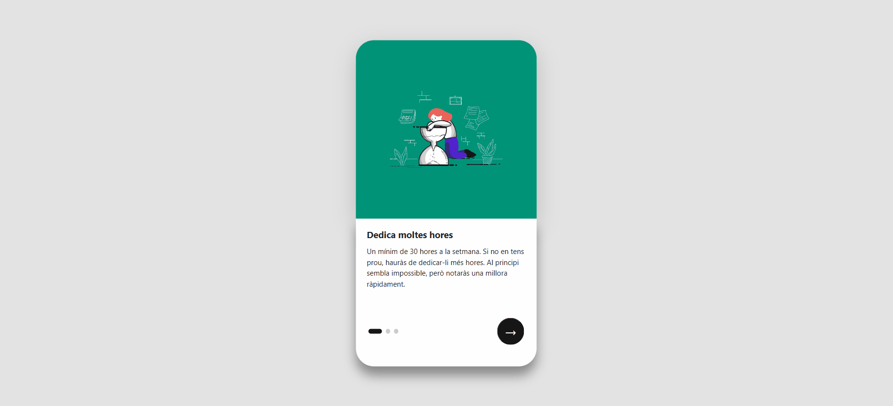

# 5.-Onboarding-digital--Angular

## 📄 Descripción - Enunciado del ejercicio

Este proyecto es una aplicación desarrollada en Angular que muestra un proceso de Onboarding digital interactivo.
El objetivo es aprender los fundamentos de Angular creando una aplicación modular basada en componentes reutilizables, aplicando animaciones, comunicación entre componentes y testing.

La aplicación permite al usuario navegar entre diferentes pasos o consejos, mostrando una imagen, texto descriptivo y una transición animada entre pasos.

La aplicación debía cumplir con:

- Seguir la siguiente estructura **App -> Home -> Escena**.
- Mostrar la información y imagenes en el navegador.
- Permitir cambiar de _pestaña_ con una **animación** de transición.
- Incluir **testing**.

---

## ✨ Funcionalidades

- **Visualización de pasos del Onboarding 📚**
  Cada paso incluye un título, descripción, imagen y color de fondo definidos mediante la interfaz IStep.

- **Navegación interactiva 🔄**
  Dos botones permiten avanzar (nextStep) o retroceder (prevStep) entre los pasos.

- **Indicadores de progreso ⚪**
  Se muestran indicadores en forma de círculos que señalan el paso actual.
  La frase activa aparece resaltada visualmente.

- **Animaciones fluidas 🎞️**
  Transiciones entre pasos mediante la animación @animSlider creada con el módulo de Angular Animations.

- **Arquitectura basada en componentes 🧩**:

  - `App` → Componente raíz.

  - `Home` → Componente contenedor que gestiona los datos.

  - `Escena` → Componente hijo encargado de mostrar los pasos y controlar la interacción del usuario.

- **Testing con Jasmine + Karma 🧪**
  Se han implementado pruebas unitarias para el componente `Escena`, comprobando la creación del componente, la navegación entre pasos y la correcta gestión del estado interno (`currentStep`, `direction`, etc.).

---

## 💻 Tecnologías Utilitzadas

- [Angular](https://angular.dev)
- **TypeScript**
- **HTML5**
- **CSS3** / **SCSS**
- [Bootstrap](https://getbootstrap.com/)
- **Angular Animations**
- **Jasmine + Karma** (para testing)

---

## 📋 Requisitos

Para ejectuar este proyecto, se necesita:

- Un entorno con Node.js instalado, recomendado v18 o superior.
- Un entorno de Angular CLI instalado globalmente (`npm install -g @angular/cli`).
- Un editor de código (recomendado: Visual Studio Code).
- Un navegador web moderno (**Chrome**, **Edge**, **OperaGX**, ...).

---

## 🛠️ Instalación

1. Clona el repositorio o descarga los archivos ZIP:
   `git clone https://github.com/Alex-Gesti-FrontEnd/5.-Onboarding-digital--Angular.git`

2. Abre la carpeta en tu editor de código.
3. Instala las dependencias ejecutando: `npm install`

---

## ▶️ Ejecución

- **Ejecución visual del proyecto**:

1. Accede a la terminal terminal con el comando: `ng serve`.
2. Abre el navegador y accede al enlace que se mostrará por la terminal. De manera general es `http://localhost:4200`.
3. Desde aquí se puede obsvervar como es la web y pulsando a los botones pasar de una plantilla a otra con nueva información y imagen.

- **Testing**:

1. Ejecuta los tests con el siguiente comando: `ng test` desde la ventana del terminal de tu editor de código.
2. Se abrirá una pestaña en tu navegador **Chrome** la cual te informará que tests se han pasado, cuales no y los errores.

---

## 🖼️ Demo

A continuación puedes ver algunas capturas de la aplicación en funcionamiento:

- Pantalla principal de la aplicación.

  

- Muestra del funcionamiento de los botones.

  

---

## © Derechos de autor

© 2025 [Alex Gesti](https://github.com/alexgesti) — Todos los derechos reservados.
